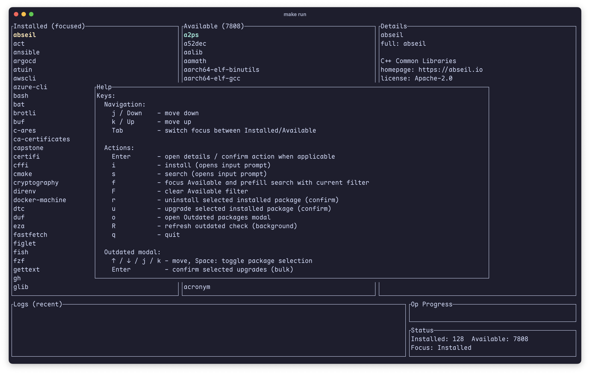

# homebrew-tui

Terminal UI for managing Homebrew packages on macOS. Built with Rust, ratatui and crossterm.

This project provides an event-driven TUI that shells out to the local `brew` executable to
list, inspect and manage formulae. It includes streaming operation logs, an Outdated bulk-upgrade
workflow, a dynamic search results modal and a built-in option to run the Homebrew installer when
`brew` isn't found on PATH.

Status

- Work in progress: this project is not stable and has known bugs and rough edges. Use at your own
  risk. Contributions welcomed; please open issues for bugs or unexpected behavior.

Screenshot



_Replace `assets/screenshot.png` with a real screenshot image (PNG recommended)._

Quick feature list

- Installed pane: list installed formulae with basic metadata and caveats shown in the Details pane
- Available pane: searchable list of formulae available via Homebrew
- Details pane: shows loaded formula info for the selected item (installed or available)
- Search modal: unicode-aware, dynamically sized Search Results overlay
- Outdated modal: select multiple outdated packages and bulk-upgrade them
- Operation modal: streams stdout/stderr from brew/installer commands and shows a progress gauge
- Startup installer prompt: when `brew` is missing the app will offer to run the official Homebrew installer (runs only after user confirms)

Keybindings (current)

- Navigation
  - j / Down        - move down
  - k / Up          - move up
  - Tab             - switch focus between Installed and Available panes

- Actions
  - Enter           - open details / confirm action (depending on focus)
  - i               - Install (opens input prompt)
  - s               - Search (opens input prompt)
  - f               - Focus Available and prefill search with the current filter
  - F               - Clear Available filter
  - r               - Uninstall selected installed package (opens Confirm)
  - u               - Upgrade selected installed package (opens Confirm)
  - o               - Open Outdated packages modal
  - R               - Refresh outdated check (runs in background)
  - q               - Quit

- Outdated modal controls
  - ↑ / ↓ / j / k   - move
  - Space           - toggle selection
  - Enter           - Confirm selected upgrades (bulk)
  - Esc             - Close Outdated modal

- Confirm dialogs
  - y / Enter       - Confirm
  - n / Esc         - Cancel

- Operation (logs) modal
  - ↑ / ↓ / j / k   - Scroll lines
  - PgUp / PgDn     - Page up / page down
  - Home / End      - Jump to top / bottom (most recent)
  - Esc / ?         - Close Operation modal

Build requirements

- Rust toolchain (stable) and cargo
- macOS (the app shells out to `brew` and may call the Homebrew installer)

Build

```sh
cargo build --release
```

Run

```sh
cargo run --release
```

Tests

```sh
cargo test
```

Important notes

- This tool shells out to the `brew` CLI for most operations. Make sure `brew` is installed and
  accessible in PATH. If not present, the app will offer to run the official Homebrew installer
  script ([https://brew.sh](https://brew.sh)) after you confirm. The installer may prompt for sudo or other
  interactive input and requires network access.
- The app streams stdout/stderr from spawned processes into the Operation modal. Progress is
  heuristically parsed from lines containing a percent sign (e.g. "42%"), so progress display
  depends on the external command output format.
- `Cargo.lock` is tracked for reproducible builds in application mode.

Contributing

- Report issues and feature requests. Prefer small, focused PRs. If you add new keybindings,
  please update the Help modal in `src/ui.rs` and the README accordingly.

License

This project is licensed under the MIT License - see the included `LICENSE` file for details.
